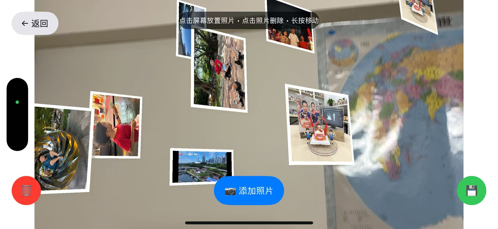

# AR 照片摆放应用

一个使用 ARKit 实现的 iOS 应用，可以将相册中的照片摆放到现实世界中，并支持保存和自动恢复照片位置。

## Screenshots

## 功能特性

### 🎯 核心功能
- **AR 照片摆放**: 从相册选择照片并在现实世界中放置
- **智能平面检测**: 自动检测水平和垂直平面
- **位置保存**: 保存照片的位置、旋转和缩放信息
- **自动恢复**: 下次启动时自动恢复之前摆放的照片

### 🎮 交互操作
- **点击放置**: 选择照片后点击屏幕任意位置放置
- **点击选择**: 点击照片进行选择，再次点击删除
- **长按移动**: 长按照片后可以移动位置
- **缩放操作**: 双指捏合缩放照片大小
- **旋转操作**: 双指旋转调整照片角度

### 🎨 视觉效果
- **智能边框**: 根据照片比例自动调整尺寸
- **白色相框**: 为每张照片添加白色边框效果
- **阴影效果**: 增加立体感的阴影
- **选中高亮**: 选中照片时显示蓝色高亮边框

## 使用方法

### 1. 启动应用
- 首次启动会请求相机和相册权限
- 确保在支持 ARKit 的设备上运行

### 2. 添加照片
1. 点击 "📷 添加照片" 按钮
2. 从相册中选择要摆放的照片
3. 点击屏幕上的任意位置放置照片

### 3. 操作照片
- **选择**: 点击照片进行选择
- **移动**: 长按选中的照片，然后移动到新位置
- **缩放**: 选中照片后使用双指捏合手势
- **旋转**: 选中照片后使用双指旋转手势
- **删除**: 选中照片后再次点击确认删除

### 4. 保存和恢复
- 点击 "💾" 按钮保存当前所有照片的位置
- 下次启动应用时会自动恢复保存的照片
- 点击 "🗑️" 按钮清除所有照片

## 技术实现

### 框架和技术
- **ARKit**: 实现增强现实功能
- **SceneKit**: 3D 场景渲染
- **Photos**: 访问相册
- **UIKit**: 用户界面

### 核心组件
- `ARPhotoViewController`: 主要的 AR 视图控制器
- `PhotoData`: 照片数据模型，包含位置、旋转、缩放信息
- `ViewController`: 启动页面和权限管理

### 数据持久化
- 使用 `UserDefaults` 保存照片数据
- 照片以 JPEG 格式压缩存储
- 支持位置、旋转、缩放信息的完整保存

## 系统要求

- iOS 11.0 或更高版本
- 支持 ARKit 的设备 (iPhone 6s 或更新机型)
- 相机和相册访问权限

## 权限说明

### 相机权限
用于 ARKit 实现增强现实功能，检测现实世界中的平面

### 相册权限
用于从相册中选择要摆放的照片

## 使用提示

1. **光线充足**: 在光线充足的环境中使用效果更佳
2. **平面检测**: 缓慢移动设备帮助检测平面
3. **稳定放置**: 在检测到的平面上放置照片更稳定
4. **定期保存**: 及时保存照片位置避免丢失

## 故障排除

### 照片无法放置
- 确保检测到平面（缓慢移动设备）
- 检查是否已选择照片

### 权限问题
- 前往设置 > 隐私 > 相机/照片，开启应用权限

### AR 功能异常
- 重启应用
- 确保设备支持 ARKit

## 开发者信息

这是一个展示 ARKit 和 SceneKit 集成使用的示例应用，演示了如何在现实世界中放置虚拟对象并实现持久化存储。